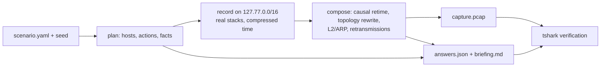

# pcapforge

[](https://github.com/j3k01/PcapForge/actions/workflows/ci.yml)
[](https://github.com/j3k01/PcapForge/releases)
[](LICENSE)
[](scenarios/LICENSE)
[](pyproject.toml)

Generate realistic, labeled packet captures with answer keys for blue-team, SOC and
detection-engineering training.

Pick a scenario, a difficulty and a seed. pcapforge records **real protocol stacks** (OS
TCP/IP, pymodbus, asyncua OPC UA, S7comm, DNS, NTP, DHCP) talking to each other on loopback addresses,
composes the traffic into a believable site topology, and writes:

- `capture.pcap` / `capture.pcapng`: decodes cleanly in Wireshark, tshark, Zeek, Suricata and Splunk Stream
- `answers.json`: IOCs, timeline with frame numbers, MITRE ATT&CK (Enterprise/ICS) mapping, questions with answers and the tshark filter that proves each answer
- `briefing.md`: the student handout (scenario text, asset inventory, register map, questions without answers)
- `submission_template.yaml`: the questions as a blank answer sheet for `pcapforge grade`
- with `--siem`: `siem/*.jsonl` logs for Splunk/Elastic and `detections/` (Suricata rules, Sigma rules, hunting guide)

The same seed always gives the same exercise, and every student can get their own variant.

> **Defensive by design.** The repository contains no malware, implants, exploit code or
> working payloads. Every "suspicious" behaviour is produced by benign clients and
> services that follow the behavioural pattern an analyst needs to recognise.
> Contributions that need weaponised code are out of scope; see [CONTRIBUTING.md](CONTRIBUTING.md#defensive-policy).

## Quick start

Requirements:
- Python 3.13
- Wireshark 4.4 or newer (`tshark` and `dumpcap`); Ubuntu 24.04 ships 4.2, so add `ppa:wireshark-dev/stable` there
- loopback capture rights:
  - Windows: Npcap with *loopback support*, the Wireshark installer default
  - Linux: none when pcapforge runs in its own user and network namespace (`unshare -rn pcapforge ...`, see
    [Platform notes](#development)), otherwise `sudo setcap cap_net_raw,cap_net_admin=eip $(which dumpcap)`
    plus, once per boot, `sudo ip route add local 127.77.0.0/16 dev lo table local quickack 1`

```console
$ pip install -e .                # medium/hard of the OT scenario also need: pip install -e .[opcua,s7]
$ pcapforge list
ot-modbus-write-manipulation  OT  easy/medium/hard  T0855,T0836     Unauthorized Modbus/TCP setpoint changes on a water-treatment PLC

$ pcapforge generate --scenario ot-modbus-write-manipulation --difficulty easy --seed 42
  [42] plan: 4020 actions, recording key 088575127c99cf5e0fbfc8c4
  [42] recording: captured
  [42] composed 13751 packets
out/ot-modbus-write-manipulation_easy_42/capture.pcap  (13751 packets, verified)
```

Optional protocol extras record more industrial background traffic: `pip install -e .[opcua]` (OPC UA,
asyncua) and `pip install -e .[s7]` (Siemens S7comm, python-snap7). Scenarios enable these actors only on
levels that need them (medium and hard of `ot-modbus-write-manipulation`); generating such a level without
the extra stops before recording with a message naming the extra to install.

A class of 25 students, each with a unique variant, or one variant per login:

```console
$ pcapforge generate -s ot-modbus-write-manipulation -d hard --seed course-2026 --count 25
$ pcapforge generate -s ot-modbus-write-manipulation -d medium --seeds-file students.txt
$ pcapforge generate -s ot-modbus-write-manipulation -d easy --seed 42 --lang pl   # Polish handout, questions and template
```

`--lang pl` translates the student-facing prose: `briefing.md`, the question texts in `answers.json` and `submission_template.yaml`. Answers, filters and register names stay unchanged. Scenarios provide translations under `translations: {pl: {title, briefing, questions}}`. Process-profile titles and register names are not translated.

Other commands:
- `pcapforge show <scenario>` describes the techniques, difficulty knobs and questions.
- `pcapforge validate` checks scenario files.
- `pcapforge verify capture.pcap -a answers.json` re-checks a capture against its key.
- `pcapforge export <run dir>` (re)creates `siem/` and `detections/` for an existing run.
- `pcapforge package <run dir>` writes a student zip and an instructor zip (see [Grading and packaging](#grading-and-packaging)).
- `pcapforge grade answers.json <submissions>` scores student answers. Hints listed under `hints_used` cost 20 % of the question's points (rounded up).
- `pcapforge export-ctfd <run dir>` writes one CTFd challenge per question in the `ctfcli` format (`ctfd/qNN-<id>/challenge.yml`). Install each with `ctf challenge install <dir>`. The first challenge carries the capture and the briefing. Sets, maps and timestamps use a canonical flag format that each challenge description states.
- `pcapforge report <run dir> [--grades grades.json]` writes `report.html` for the debrief: one self-contained page (inline SVG, no external resources) with the incident timeline and frame numbers, before/after charts of the changed setpoints and affected measurements (needs `siem/`, i.e. `--siem` or `pcapforge export`), the answers with their tshark checks, and optional class results from `pcapforge grade --json`.

### What the analyst sees (easy, seed 42)

```console
$ tshark -r capture.pcap -Y "modbus.func_code in {6, 43} && !modbus.request_frame" \
    -T fields -e frame.time_utc -e eth.src -e ip.src -e ip.dst -e modbus.func_code -e modbus.reference_num -e modbus.regval_uint16
2025-03-22T11:45:33.663741Z  b8:27:eb:23:26:6d  10.241.35.219  10.241.35.159  43
2025-03-22T11:45:36.016219Z  b8:27:eb:23:26:6d  10.241.35.219  10.241.35.159  6  8  1587
2025-03-22T11:45:37.918517Z  b8:27:eb:23:26:6d  10.241.35.219  10.241.35.159  6  4  635
...
```

Wireshark 4.2 and older (the Ubuntu 24.04 package) do not decode the value of a Write Single Register
(function 6): students see it only as raw `modbus.data` bytes (`06:33` = 1587), and `modbus.regval_uint16`
and the answer-key filters that use it match nothing. pcapforge itself needs 4.4+ to verify a capture.

And the matching entry in `answers.json`:

```json
{
  "id": "first_write",
  "text": "At what time (UTC) was the first unauthorized write request sent?",
  "type": "timestamp",
  "answer": "2025-03-22T11:45:36.016219Z",
  "tolerance_s": 1,
  "checks": [{"filter": "frame.number == 7209 && modbus.func_code in {5, 6, 15, 16} && ip.src == 10.241.35.219",
              "expect": {"count": 1}}]
}
```

## Grading and packaging

`pcapforge package` splits a run into what students get and what stays with the instructor:

```console
$ pcapforge package out/ot-modbus-write-manipulation_easy_42 --out handouts
handouts/ot-modbus-write-manipulation_easy_42-student.zip
handouts/ot-modbus-write-manipulation_easy_42-instructor.zip
```

- `<run>-student.zip`: the capture, `briefing.md` and `submission_template.yaml`, nothing else.
- `<run>-instructor.zip`: the whole run directory, including `answers.json`, `siem/` and `detections/`.

Without `--out` the zips are written next to the run directory. Several run directories can be packaged at
once (`pcapforge package out/*/ --out handouts`). The zips are byte-identical for the same run.

Students fill in `submission_template.yaml` (one file per student, named after the student), e.g.
`jane-doe.yaml` for the easy run above:

```yaml
# 1. Which IP address issued the unauthorized Modbus write requests?
#    (10 points; answer: an IP address)
source_ip: 10.241.35.219
# 2. Which MAC address did the sensor see on the frames carrying those write requests?
#    (5 points; answer: a MAC address)
source_mac: B8-27-EB-23-26-6D
target_ip: 10.241.35.159
first_write: 2025-03-22 11:45:36.4
points_changed: [pid_level_ti, level_high_alarm, level_low_alarm]
values_written: {pid_level_ti: 1587, level_high_alarm: 635, level_low_alarm: 0, chlorine_dose_sp: 8.45}
functions_used: [6, 16]
discovery: Rockwell Automation 2080-LC50-24QWB
impact: [chlorine_residual, level_high, level_low]
joined_host_name: raspberrypi
technique: T0831
```

A whole class can also hand in one CSV with the columns `student,question,answer`. Repeat a row to give
several elements of a list (`alice,points_changed,pid_level_ti`), or write them in one cell separated by
commas; map answers are `name=value` pairs (`pid_level_ti=1587; level_low_alarm=0`).

```console
$ pcapforge grade out/ot-modbus-write-manipulation_easy_42/answers.json submissions/jane-doe.yaml
jane-doe: 85/100 (85 %)   [submissions/jane-doe.yaml]
question          type       score     result   given
----------------  ---------  --------  -------  ----------------------------------------
source_ip         ip         10/10     correct  10.241.35.219
source_mac        mac        5/5       correct  B8-27-EB-23-26-6D
target_ip         ip         10/10     correct  10.241.35.159
first_write       timestamp  10/10     correct  2025-03-22 11:45:36.4
points_changed    set        11.25/15  partial  ["pid_level_ti", "level_high_alarm", "l…
values_written    map        11.25/15  partial  {"pid_level_ti": "1587", "level_high_al…
functions_used    set        2.5/5     partial  ["6", "16"]
discovery         text       10/10     correct  Rockwell Automation 2080-LC50-24QWB
impact            set        10/10     correct  ["chlorine_residual", "level_high", "le…
joined_host_name  text       5/5       correct  raspberrypi
technique         text       0/5       wrong    T0831

$ pcapforge grade answers.json submissions/*.yaml class.csv --json > grades.json
```

`first_write` is 0.38 s off but inside the key's `tolerance_s: 1`; `points_changed` names 3 of the 4 points
(3/4 × 15); `values_written` has 3 of 4 values within 0.5 % (8.45 is 1.1 % off 8.36); `functions_used` has
one correct and one extra code (1/2 × 5).

Each question is scored by its `type` in `answers.json`:

| type | correct when | partial credit |
|---|---|---|
| `ip` | same address; whitespace and leading zeros (`10.241.035.219`) ignored | - |
| `mac` | same 12 hex digits; case and `:` `-` `.` separators ignored | - |
| `number` | equal, or within `tolerance` when the key has one | - |
| `timestamp` | within `tolerance_s`; ISO 8601 with `T` or space, any fractional digits, `Z` or an offset; times without a zone are UTC | - |
| `set` | same elements, any order, case-insensitive | \|correct ∩ given\| / \|correct ∪ given\| × points: missing and extra elements both cost |
| `map` | every key present with the right value (numbers within 0.5 %) | matched keys / \|answer keys ∪ given keys\| × points |
| `text` | the answer or any `accept` alternative, ignoring case and repeated whitespace | - |

Blank answers score 0. Question ids that are not in the key are listed under the student and not scored.
With more than one student the report ends with a class summary (one column per question, numbered as
in `briefing.md`). `--json` prints every student's score, percentage, per-question result
(`correct`, `partial`, `wrong`, `blank`), given and expected answer. `grade` always exits 0 once the files
could be read.

## SIEM export and detection content

`--siem` (or `pcapforge export <run dir>` later) turns a run into a detection-engineering lab:

```console
$ pcapforge generate -s ot-modbus-write-manipulation -d easy --seed 42 --siem
$ pcapforge export out/ot-modbus-write-manipulation_easy_42
out/ot-modbus-write-manipulation_easy_42/detections/hunting.md
out/ot-modbus-write-manipulation_easy_42/detections/sigma/*.yml  (4 rules)
out/ot-modbus-write-manipulation_easy_42/detections/suricata.rules
out/ot-modbus-write-manipulation_easy_42/siem/arp.jsonl  (25 records)
out/ot-modbus-write-manipulation_easy_42/siem/dhcp.jsonl  (4 records)
out/ot-modbus-write-manipulation_easy_42/siem/dns.jsonl  (0 records)
out/ot-modbus-write-manipulation_easy_42/siem/flows.jsonl  (40 records)
out/ot-modbus-write-manipulation_easy_42/siem/modbus.jsonl  (3975 records)
out/ot-modbus-write-manipulation_easy_42/siem/name_resolution.jsonl  (0 records)
out/ot-modbus-write-manipulation_easy_42/siem/ntp.jsonl  (33 records)
```

`siem/` holds one JSON event per line, decoded by a single tshark pass:

| file | one record per | main fields |
|---|---|---|
| `flows.jsonl` | TCP connection / UDP 5-tuple exchange / other IP pair | `src`, `dest`, `src_port`, `dest_port`, `transport`, `app`, `duration`, `packets_out/in`, `bytes_out/in` (IP bytes), `state` (`established`, `mid_session` = no SYN seen, `closed` = FIN, `reset`; UDP `bidirectional` / `one_way`) |
| `modbus.jsonl` | request/response transaction | `unit_id`, `trans_id`, `function_code`, `function`, `write`, `table`, `address`, `quantity`, `values` (written raw registers for writes, read raw registers/bits for successful reads), `exception`, `response_time_ms`, `request_frame`; for writes to a PLC with a known register map: `point`, `unit`, `value` (engineering), `in_normal_band` |
| `dns.jsonl` | query/response | `query`, `qtype`, `rcode`, `answers`, `ttl`, `response_time_ms` |
| `ntp.jsonl` | client request/server response | `version`, `stratum`, `refid`, `server_time`, `offset_ms`, `response_time_ms` |
| `name_resolution.jsonl` | LLMNR / NBNS / mDNS / SSDP / browser datagram | `app`, `message`, `query`, `qtype`, `answers` |
| `arp.jsonl` | ARP packet | `operation`, `src`, `src_mac`, `dest`, `dest_mac`, `gratuitous`, `probe` (RFC 5227 address conflict probe from 0.0.0.0) |
| `dhcp.jsonl` | DHCPv4 message | `message` (`discover`, `offer`, `request`, `ack`, `inform`, `release`, ...), `xid`, `client_mac`, `client_addr`, `assigned_addr`, `requested_addr`, `server_id`, `host_name`, `client_fqdn`, `vendor_class`, `lease_time_s`, `router`, `dns_servers`, `domain` |

Every record has `ts` (ISO-8601 UTC, microseconds, `Z`) for Splunk `_time` / Elastic `@timestamp`
and `epoch`; field names follow the Splunk CIM (`src`, `dest`, `src_port`, `dest_port`, `transport`, `app`).
A write from the easy run above:

```json
{"ts": "2025-03-22T11:45:36.016219Z", "src": "10.241.35.219", "src_port": 37312, "dest": "10.241.35.159", "dest_port": 502,
 "src_mac": "b8:27:eb:23:26:6d", "function_code": 6, "function": "write_single_register", "write": true, "table": "holding",
 "address": 8, "quantity": 1, "values": [1587], "response_time_ms": 5.318, "request_frame": 7209,
 "point": "pid_level_ti", "unit": "s", "value": 1587.0, "in_normal_band": false, ...}
```

Loading: in Splunk use sourcetype `pcapforge:<file stem>` (e.g. `pcapforge:modbus`) with
`INDEXED_EXTRACTIONS = json`, `TIMESTAMP_FIELDS = ts`, `TIME_FORMAT = %Y-%m-%dT%H:%M:%S.%6NZ`; in Elastic
use one index per file (`pcapforge-modbus`, ...) with `ts` as the timestamp field.

`detections/` is generated from the site model in `answers.json`:
- `suricata.rules` (sids 9100000+): any Modbus write to a PLC from a host that is not an approved writer
  (hosts of `modbus.operator` actors), device identification (function 43) from a host that is not a
  SCADA client, and per writable holding register with a normal band, writes above / below the band
  (raw register units). Suricata's Modbus parser is off by default:
  `suricata -r capture.pcap -S suricata.rules --set app-layer.protocols.modbus.enabled=true -k none -l logs`.
- `sigma/*.yml`: SIEM-agnostic [Sigma](https://sigmahq.io) rules over the JSON-lines export
  (`logsource: {product: pcapforge, service: <dataset>}`): the unapproved-writer and device-identification
  rules (same roles as the Suricata ones), an out-of-band write rule keyed on the export's `in_normal_band`
  field, a connection-from-an-unexpected-host rule over the `flows` dataset (the port-502 sweep), and,
  when a `dhcp.client` runs, a new-host-on-the-control-LAN rule. Convert with
  [sigma-cli](https://github.com/SigmaHQ/sigma-cli), e.g. `sigma convert -t splunk detections/sigma/`.
- `hunting.md`: per question, the answer, the verified Wireshark filters from the answer key, and a
  Splunk SPL search and Kibana KQL filter over the export with a "what to look for" note. The SPL/KQL
  are templates from the scenario's `hunt` blocks and are not machine-verified.

On the hard level the unauthorized writes come from the approved engineering workstation, so only
the out-of-band rules fire; the unapproved-writer rule fires on easy and medium.

## Scenarios

| id | line | techniques | what happens |
|---|---|---|---|
| `ot-modbus-write-manipulation` | OT | T0855, T0836 (+T0888, T0861 with discovery) | An HMI and a historian poll the water-treatment PLCs (medium/hard: also a SCADA/OPC UA server and an S7comm-monitored S7-1500). A host outside the approved change path writes setpoints outside their normal band. |
| `ot-modbus-discovery` | OT | T0846, T0888, T0861 | An HMI and a historian poll the PLCs. A host that is not a normal Modbus client sweeps the control subnet for port 502, then reads each PLC's device identification (function 43) and enumerates its register map (oversized reads rejected with illegal_data_address). Reconnaissance only — nothing is written. |
| `ot-modbus-command-replay` | OT | T0855, T0831 | An HMI and a historian poll the PLCs and the engineering workstation makes approved setpoint changes. An unapproved host re-sends copies of those operator commands (same register, same value) off-cycle, so every written value is inside the normal band — the tell is the source and the timing, not the value. |
| `ot-baseline-operations` | OT | none (no incident) | Normal operations only: polling, OPC UA/S7 monitoring (medium/hard), approved operator changes, NTP/DNS/Windows chatter. Process drawn per seed on every level. For baselining exercises, false-positive tuning and anomaly-detection datasets. |

Difficulty levels of `ot-modbus-write-manipulation`:

| | easy | medium | hard |
|---|---|---|---|
| length | 15 min, ~14k packets | 45 min, ~199k packets | 2 h, ~694k packets |
| process | drinking water | drawn per seed: drinking water, wastewater, building HVAC or power substation | drawn per seed (same four) |
| PLCs | 2 | 2–4 Modbus (per seed) + 1 Siemens S7-1500 | 3–5 Modbus (per seed) + 1 Siemens S7-1500 |
| writer | unknown Raspberry Pi plugged into the control LAN during the capture (leases its address from the firewall's DHCP pool) | laptop on the IT subnet, routed through the firewall (gateway MAC) | the legitimate engineering workstation |
| discovery | identity read + register enumeration | yes | none |
| changes | burst of extreme values | spread over 20 min, moderate values | spread over 1 h, values just outside the band, mixed with 6 legitimate operator changes |
| OT background | HMI and historian poll the PLCs (Modbus/TCP) | + SCADA server polls the PLCs and serves them over OPC UA to the historian (one subscription per PLC: Publish every 2 s, ServerStatus Read every 5 s); HMI and historian read the S7-1500 over S7comm | + OPC UA secure-channel renewals |
| noise | NTP, ARP | + a vendor service laptop that joins over DHCP (DORA, ARP probes, DHCPINFORM) and releases its lease before leaving, DNS, Windows chatter (LLMNR, NBNS, mDNS, SSDP, browser announcements), IPv6 link-local baseline of the Windows hosts (DAD, Router Solicitation, MLDv2, LLMNR/mDNS over IPv6, DHCPv6 Solicit), retransmissions, capture starts mid-session, SPAN artefacts (VLAN 20, 0.2 % duplicated frames, 0.05 % sensor drops) | + more retransmissions, twice the Windows chatter, VLAN 120, 0.5 % duplicates, 0.1 % drops |

## How it works



1. **Plan.** The seed decides the site (name, domain, devices), the actions on a virtual timeline, and the facts the answer key is built from.
2. **Record.** Each host gets its own loopback address. pymodbus PLCs run a physical-process model (see [Process profiles](#process-profiles) below), so polled values evolve over the virtual timeline, and a written setpoint visibly drives the measurements and alarms that follow it. OPC UA tags of a SCADA server and S7 data blocks read the same models. Clients run back-to-back, which captures hours of activity in seconds; payload timestamps (NTP, OPC UA) come from the virtual clock. A UDP marker before each action ties packets to actions. Recordings are cached by plan hash.
3. **Compose.** Packets keep their recorded order and bytes. Timing is rebuilt causally from device profiles: per-host link latency, PLC processing time, the OS delayed-ACK behaviour and retransmission timeouts. The rest of the realism layer:
   - IP/MAC/port rewrite with ephemeral ports per OS
   - ISN remap, TTL by OS minus routed hops, IP-ID behaviour per OS
   - TCP options and window per OS, recomputed checksums
   - DNS A records mapped to the final topology
   - multicast and broadcast discovery traffic gets its group or subnet broadcast address, the matching Ethernet group MAC and the sender OS's TTL, and is seen only from hosts on the sensor segment
   - only packets visible from the SPAN port are kept
   - routed traffic carries the gateway MAC
   - ARP is synthesized
4. **Answer key and verification.** Facts resolve to frames and timestamps. tshark checks:
   - no malformed frames, bad checksums or expert errors
   - no loopback addresses leak (127.0.0.0/8, ::1)
   - every question's filter matches the capture

### Reproducibility

- Same `--seed` gives the same plan and the same `answers.json`. With a cached recording, the capture is byte-identical too.
- A live re-recording on another machine gives the same answers. The capture can differ only in low-level stack details.
- On medium and hard the seed also draws the story structure: the physical process (four profiles, each with its own register map, units and physical effects) and the number of PLCs. Scenario authors get this through `vars` values `{choose: [...]}` and `{range: [lo, hi]}`.
- `--base-seed` shares one recording between many `--seed`s. Students then get different IPs, MACs, ports and timing jitter on the same story. Without it, every seed is a fully independent variant.

## Writing a scenario

Scenarios are YAML files under `scenarios/<line>/<id>/scenario.yaml` (CC-BY-4.0). They are validated by
[`scenario.schema.json`](src/pcapforge/scenario/scenario.schema.json); add the
`# yaml-language-server: $schema=...` header line for editor completion. The full authoring guide
(topology, actors, `${}` references and `when`, difficulty knobs, questions, testing checklist) is in
[CONTRIBUTING.md](CONTRIBUTING.md#writing-a-scenario). The main sections:

```yaml
schema: pcapforge/scenario@1
id: ot-modbus-write-manipulation
line: ot
mitre:
  - {framework: ics, id: T0836, name: Modify Parameter}
topology:
  sensor: control                               # SPAN port location
  subnets: [{id: control, pool: 10.0.0.0/8, prefix: 24}]
  hosts:
    - {id: plc, count: "${vars.plc_count}", device: [schneider-m340, siemens-s7-1200], subnet: control}
actors:
  - {id: plc_service, type: modbus.server, hosts: plc, params: {process: water_treatment}}
  - {id: change, type: modbus.writer, hosts: "${vars.writer_host}", incident: true, params: {...}}
difficulty:
  easy: {duration: 15m, impairments: {retransmit_rate: 0}, vars: {plc_count: 2, writer_host: rogue}}
questions:
  - id: source_ip
    text: Which IP address issued the unauthorized Modbus write requests?
    answer: "${facts.change.source.ip}"
    check: {filter: "mbtcp && modbus.func_code in {5, 6, 15, 16} && ip.src == ${facts.change.source.ip}", expect: {min: 1}}
    hunt:                                       # optional, rendered into detections/hunting.md
      dataset: modbus
      spl: "index=* sourcetype=pcapforge:modbus write=true | stats count BY src, dest"
      kql: "write : true"
      look_for: Writers other than the engineering workstation.
```

Built-in actor types:
- `modbus.server`
- `modbus.poller`
- `modbus.operator`
- `modbus.writer`
- `dns.server`, `dns.client`
- `ntp.server`, `ntp.client`
- `s7.server`, `s7.client` (Siemens S7comm on ISO-TSAP port 102, optional extra `s7`): an S7-1200/1500 CPU whose data blocks mirror its process model (DB1 measurements and DB2 setpoints as REAL, DB3 status bits) and whose SZL identity (order code, firmware, module name, serial) follows the device profile; the client keeps one session per PLC (COTP connect, setup communication, SZL identification), reads the DBs with cyclic multi-item Read Var jobs and the CPU state (SZL 0x0424) every `szl_interval` seconds. `params: {process, rack, slot}` / `{targets, interval, jitter, dbs, identify, szl_interval}`
- `opcua.server`, `opcua.client` (OPC UA binary on port 4840, SecurityPolicy None, optional extra `opcua`): a SCADA / OPC UA server that publishes the process points of the PLCs in `sources` (hosts of a `modbus.server`) as tags `ns=2;s=PLC01.clearwell_level`, grouped per PLC into `Measurements`, `Setpoints`, `Commands` and `Status`, with values from the PLC's process model at the request's virtual time and its BuildInfo from the device profile's `identity`; the client (historian / MES collector) opens one long-lived session (Hello, OpenSecureChannel, CreateSession, ActivateSession, NamespaceArray read, browse of the tag tree), creates one subscription per PLC with monitored items per tag group, sends Publish requests every `publishing_interval`, reads ServerStatus State/CurrentTime every `keepalive_interval` and renews the secure channel at 75 % of `token_lifetime`. `params: {sources}` / `{server, publishing_interval, keepalive_interval, token_lifetime, jitter, application, product_uri}`
- `dhcp.server`, `dhcp.client` (DHCPv4, RFC 2131): the server (e.g. the firewall) leases addresses from `pool` on one subnet and hands out router, DNS, domain and NTP; static hosts on that subnet stay outside the pool. A client either holds a lease from before the capture and renews it at T1, or joins at `join` (DISCOVER / OFFER / REQUEST / ACK from 0.0.0.0 to 255.255.255.255, ARP address conflict detection, then a DHCPINFORM on Windows) and can leave at `leave` with a DHCPRELEASE. Message formats follow the OS client (`style`: `windows`, `dhcpcd`). `params: {subnet, pool, lease, dns, ntp}` / `{server, join, leave, release, style}`
- `windows.chatter` (names the site DNS does not know: NXDOMAIN, then LLMNR, NBNS and mDNS fallback; SSDP; browser host announcements; `params: {rate}`)

Device and OS-stack profiles are in [`profiles/devices.yaml`](src/pcapforge/profiles/devices.yaml). Their OUIs are checked against Wireshark's manufacturer database. Process models are in [`profiles/processes/`](src/pcapforge/profiles/processes/). New actors go in `src/pcapforge/actors/` and implement `plan()`, plus `serve()` for servers or `execute()` for clients. Actors that send one-way multicast or broadcast datagrams list the recording sinks they use in `sinks` (see `topology.SINKS`). Actors built on a third-party library declare it as an optional extra in `requires` and import it lazily. [CONTRIBUTING.md](CONTRIBUTING.md#extending-the-engine) has the details.

### Process profiles

A `modbus.server` actor serves one process profile (`params: {process: <id>}`) from `src/pcapforge/profiles/processes/`. Each is a register map with normal bands and a deterministic process model, so polled values move over the virtual day and a written setpoint drives the measurements and alarm bits that depend on it:

- `water_treatment`: drinking-water clearwell and chlorination (level, chlorine residual, pH, pump speed, daily inlet/outlet flow).
- `wastewater_treatment`: activated-sludge aeration basin and clarifier. The DO setpoint and the daily influent curve drive blower speed, dissolved oxygen and effluent ammonia; return-sludge flow sets the sludge blanket level; plus pH, MLSS and alarm bits.
- `hvac_building`: AHU, three fan-coil zones and a chiller. A daily occupancy curve and outdoor temperature load the zones; zone temperatures track their setpoints while the fan-coil valves, CO2-driven outdoor-air damper, chilled-water return and chiller load absorb the load; plus fan and chiller status bits.
- `power_substation`: 33/11 kV transformer with on-load tap changer and four feeders. Feeder breaker commands (coils) are mirrored by status bits (discretes). The load curve drives feeder currents, power factor, Mvar and transformer oil/winding temperature. The tap-position setpoint moves the busbar voltage (1.25 % per step) and can trip the voltage alarms.

## Development

```console
$ pip install -e .[test,opcua,s7]
$ pytest
```

See [CONTRIBUTING.md](CONTRIBUTING.md) for the defensive policy, the setup on Windows and Linux, and the
checklist for pull requests.

The end-to-end tests record real traffic, so they need tshark 4.4+, dumpcap (or tcpdump) and loopback capture rights; they are skipped otherwise. Medium and hard also need the `opcua` and `s7` extras. `tests/test_grade.py` (grading rules, the student zip holds no answer material) needs neither. The end-to-end tests check that:
- every capture passes the tshark integrity checks and all answer-key filters;
- every write in the key points at a frame with the right source, target, function, register and value;
- Scapy recomputes the same checksums;
- the same seed gives byte-identical output;
- `siem/modbus.jsonl` flags exactly the incident writes as out of band and the operator writes as in band, and `siem/flows.jsonl` accounts for every IP packet and byte;
- with `suricata` on PATH (CI installs it), the generated rules alert on every incident write and on no operator write, and the unapproved-writer rule fires on easy/medium but not hard;
- OPC UA runs only between the historian and the SCADA server (medium/hard: mid-session Publish and watchdog Read; easy: none), every message fits one Ethernet segment, every payload timestamp is on the scenario clock and the published tag values follow the process model (`tests/test_opcua.py`, which also records a full session from Hello to subscriptions and secure-channel renewals);
- S7comm sessions decode and their data blocks mirror the process (`tests/test_s7.py`);
- recording without an optional extra stops before capturing, with the install command.

Platform notes:
- **Windows:** Npcap's `\Device\NPF_Loopback` adapter is used; administrator rights are not needed.
- **Linux:** recording uses `lo`. Docker is not required. Linux delays loopback ACKs and piggybacks them on
  the next segment; before recording, pcapforge adds a `quickack 1` route for `127.77.0.0/16` so every
  segment is acknowledged at once, as on Windows, and the composer models each device's delayed ACK.
  Without it a Linux capture would lose most pure ACKs (easy: ~8k instead of ~14k packets). The rootless
  way needs neither sudo nor setcap:

  ```console
  $ unshare -rn pcapforge generate -s ot-modbus-write-manipulation -d easy --seed 42
  $ unshare -rn pytest
  ```

  `unshare -rn` runs the command as root of a new user and network namespace with its own `lo`:
  dumpcap/tcpdump can capture it, and pcapforge brings it up and adds the route there. Both disappear when
  the command exits. This needs unprivileged user namespaces (WSL 2 and most distributions allow them;
  Ubuntu 23.10+ can restrict them with AppArmor, `kernel.apparmor_restrict_unprivileged_userns`). Without a
  namespace, give dumpcap capture rights and add the route once per boot (see Requirements). tshark warns
  about running as root inside the namespace; the warning is harmless.
- **macOS:** add loopback aliases for `127.77.0.0/16` first.

## Roadmap

The full, prioritised plan is in [ROADMAP.md](ROADMAP.md). Highlights:

- IT line, using benign equivalents only:
  - HTTPS beaconing to a local test server
  - DNS tunnelling against a local resolver
  - port scan followed by authentication failures against local test services
  - volumetric floods against a local sink
- More OT protocols: EtherNet/IP, DNP3.
- Optional LLM "director" that drafts scenario YAML from a text description. It will never generate packets.

## License

Code: [Apache-2.0](LICENSE). Scenarios and profiles: [CC-BY-4.0](scenarios/LICENSE).
