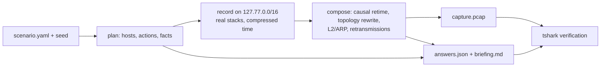

# pcapforge

Generate realistic, labeled packet captures with answer keys for blue-team, SOC and
detection-engineering training.

Pick a scenario, a difficulty and a seed. pcapforge records **real protocol stacks** (OS
TCP/IP, pymodbus, DNS, NTP) talking to each other on loopback addresses, composes the
traffic into a believable site topology, and writes:

- `capture.pcap` / `capture.pcapng`: decodes cleanly in Wireshark, tshark, Zeek, Suricata and Splunk Stream
- `answers.json`: IOCs, timeline with frame numbers, MITRE ATT&CK (Enterprise/ICS) mapping, questions with answers and the tshark filter that proves each answer
- `briefing.md`: the student handout (scenario text, asset inventory, register map, questions without answers)

The same seed always gives the same exercise, and every student can get their own variant.

> **Defensive by design.** The repository contains no malware, implants, exploit code or
> working payloads. Every "suspicious" behaviour is produced by benign clients and
> services that follow the behavioural pattern an analyst needs to recognise.
> Contributions that need weaponised code are out of scope.

## Quick start

Requirements:
- Python 3.13
- Wireshark 4.x (`tshark` and `dumpcap`)
- loopback capture rights:
  - Windows: Npcap with *loopback support*, the Wireshark installer default
  - Linux: `sudo setcap cap_net_raw,cap_net_admin=eip $(which dumpcap)`

```console
$ pip install -e .
$ pcapforge list
ot-modbus-write-manipulation  OT  easy/medium/hard  T0855,T0836     Unauthorized Modbus/TCP setpoint changes on a water-treatment PLC

$ pcapforge generate --scenario ot-modbus-write-manipulation --difficulty easy --seed 42
  [42] plan: 4018 actions, recording key bbf20dc600bfba1913ac4a0c
  [42] recording: captured
  [42] composed 13739 packets
out/ot-modbus-write-manipulation_easy_42/capture.pcap  (13739 packets, verified)
```

A class of 25 students, each with a unique variant, or one variant per login:

```console
$ pcapforge generate -s ot-modbus-write-manipulation -d hard --seed course-2026 --count 25
$ pcapforge generate -s ot-modbus-write-manipulation -d medium --seeds-file students.txt
```

Other commands:
- `pcapforge show <scenario>` describes the techniques, difficulty knobs and questions.
- `pcapforge validate` checks scenario files.
- `pcapforge verify capture.pcap -a answers.json` re-checks a capture against its key.

### What the analyst sees (easy, seed 42)

```console
$ tshark -r capture.pcap -Y "modbus.func_code in {6, 43} && !modbus.request_frame" \
    -T fields -e frame.time_utc -e eth.src -e ip.src -e ip.dst -e modbus.func_code -e modbus.reference_num -e modbus.regval_uint16
2025-03-22T11:45:33.663741Z  b8:27:eb:23:26:6d  10.241.35.164  10.241.35.159  43
2025-03-22T11:45:36.016219Z  b8:27:eb:23:26:6d  10.241.35.164  10.241.35.159  6  8  1587
2025-03-22T11:45:37.918517Z  b8:27:eb:23:26:6d  10.241.35.164  10.241.35.159  6  4  635
...
```

And the matching entry in `answers.json`:

```json
{
  "id": "first_write",
  "text": "At what time (UTC) was the first unauthorized write request sent?",
  "type": "timestamp",
  "answer": "2025-03-22T11:45:36.016219Z",
  "tolerance_s": 1,
  "checks": [{"filter": "frame.number == 7197 && modbus.func_code in {5, 6, 15, 16} && ip.src == 10.241.35.164",
              "expect": {"count": 1}}]
}
```

## Scenarios

| id | line | techniques | what happens |
|---|---|---|---|
| `ot-modbus-write-manipulation` | OT | T0855, T0836 (+T0888, T0861 with discovery) | An HMI and a historian poll the water-treatment PLCs. A host outside the approved change path writes setpoints outside their normal band. |

Difficulty levels of `ot-modbus-write-manipulation`:

| | easy | medium | hard |
|---|---|---|---|
| length | 15 min, ~14k packets | 45 min, ~117k packets | 2 h, ~415k packets |
| PLCs | 2 | 3 | 4 |
| writer | unknown Raspberry Pi on the control LAN | laptop on the IT subnet, routed through the firewall (gateway MAC) | the legitimate engineering workstation |
| discovery | identity read + register enumeration | yes | none |
| changes | burst of extreme values | spread over 20 min, moderate values | spread over 1 h, values just outside the band, mixed with 6 legitimate operator changes |
| noise | NTP, ARP | + DNS, Windows chatter (LLMNR, NBNS, mDNS, SSDP, browser announcements), retransmissions, capture starts mid-session | + more retransmissions, twice the Windows chatter |

## How it works



1. **Plan.** The seed decides the site (name, domain, devices), the actions on a virtual timeline, and the facts the answer key is built from.
2. **Record.** Each host gets its own loopback address. pymodbus PLCs run a physical-process model (water treatment), so polled values evolve over the virtual timeline, and a written setpoint visibly drives the measurements and alarms that follow it. Clients run back-to-back, which captures hours of activity in seconds. A UDP marker before each action ties packets to actions. Recordings are cached by plan hash.
3. **Compose.** Packets keep their recorded order and bytes. Timing is rebuilt causally from device profiles: per-host link latency, PLC processing time, the OS delayed-ACK behaviour and retransmission timeouts. The rest of the realism layer:
   - IP/MAC/port rewrite with ephemeral ports per OS
   - ISN remap, TTL by OS minus routed hops, IP-ID behaviour per OS
   - TCP options and window per OS, recomputed checksums
   - DNS A records mapped to the final topology
   - multicast and broadcast discovery traffic gets its group or subnet broadcast address, the matching Ethernet group MAC and the sender OS's TTL, and is seen only from hosts on the sensor segment
   - only packets visible from the SPAN port are kept
   - routed traffic carries the gateway MAC
   - ARP is synthesized
4. **Answer key and verification.** Facts resolve to frames and timestamps. tshark checks:
   - no malformed frames, bad checksums or expert errors
   - no loopback addresses leak
   - every question's filter matches the capture

### Reproducibility

- Same `--seed` gives the same plan and the same `answers.json`. With a cached recording, the capture is byte-identical too.
- A live re-recording on another machine gives the same answers. The capture can differ only in low-level stack details.
- `--base-seed` shares one recording between many `--seed`s. Students then get different IPs, MACs, ports and timing jitter on the same story. Without it, every seed is a fully independent variant.

## Writing a scenario

Scenarios are YAML files under `scenarios/<line>/<id>/scenario.yaml` (CC-BY-4.0). They are validated by
[`scenario.schema.json`](src/pcapforge/scenario/scenario.schema.json); add the
`# yaml-language-server: $schema=...` header line for editor completion. The main sections:

```yaml
schema: pcapforge/scenario@1
id: ot-modbus-write-manipulation
line: ot
mitre:
  - {framework: ics, id: T0836, name: Modify Parameter}
topology:
  sensor: control                               # SPAN port location
  subnets: [{id: control, pool: 10.0.0.0/8, prefix: 24}]
  hosts:
    - {id: plc, count: "${vars.plc_count}", device: [schneider-m340, siemens-s7-1200], subnet: control}
actors:
  - {id: plc_service, type: modbus.server, hosts: plc, params: {process: water_treatment}}
  - {id: change, type: modbus.writer, hosts: "${vars.writer_host}", incident: true, params: {...}}
difficulty:
  easy: {duration: 15m, impairments: {retransmit_rate: 0}, vars: {plc_count: 2, writer_host: rogue}}
questions:
  - id: source_ip
    text: Which IP address issued the unauthorized Modbus write requests?
    answer: "${facts.change.source.ip}"
    check: {filter: "mbtcp && modbus.func_code in {5, 6, 15, 16} && ip.src == ${facts.change.source.ip}", expect: {min: 1}}
```

Built-in actor types:
- `modbus.server`
- `modbus.poller`
- `modbus.operator`
- `modbus.writer`
- `dns.server`, `dns.client`
- `ntp.server`, `ntp.client`
- `windows.chatter` (names the site DNS does not know: NXDOMAIN, then LLMNR, NBNS and mDNS fallback; SSDP; browser host announcements; `params: {rate}`)

Device and OS-stack profiles are in [`profiles/devices.yaml`](src/pcapforge/profiles/devices.yaml). Their OUIs are checked against Wireshark's manufacturer database. Process models are in [`profiles/processes/`](src/pcapforge/profiles/processes/). New actors go in `src/pcapforge/actors/` and implement `plan()`, plus `serve()` for servers or `execute()` for clients. Actors that send one-way multicast or broadcast datagrams list the recording sinks they use in `sinks` (see `topology.SINKS`).

## Development

```console
$ pip install -e .[test]
$ pytest
```

The end-to-end tests record real traffic, so they need tshark, dumpcap and loopback capture rights; they are skipped otherwise. They check that:
- every capture passes the tshark integrity checks and all answer-key filters;
- every write in the key points at a frame with the right source, target, function, register and value;
- Scapy recomputes the same checksums;
- the same seed gives byte-identical output.

Platform notes:
- **Windows:** Npcap's `\Device\NPF_Loopback` adapter is used; administrator rights are not needed.
- **Linux:** recording uses `lo`. Docker is not required.
- **macOS:** add loopback aliases for `127.77.0.0/16` first.

## Roadmap

- IT line, using benign equivalents only:
  - HTTPS beaconing to a local test server
  - DNS tunnelling against a local resolver
  - port scan followed by authentication failures against local test services
  - volumetric floods against a local sink
- More OT protocols: S7comm, EtherNet/IP, DNP3.
- Optional LLM "director" that drafts scenario YAML from a text description. It will never generate packets.

## License

Code: [Apache-2.0](LICENSE). Scenarios and profiles: [CC-BY-4.0](scenarios/LICENSE).
